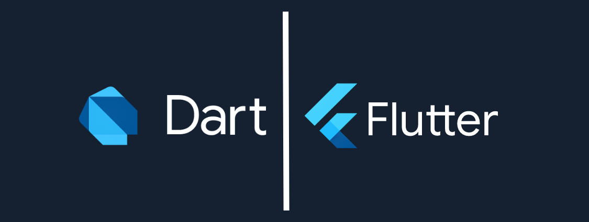

Hi, I’m Lukas, a knowledge-seeking software engineer with a current focus on multiplatform applications. During more than three years with Flutter, I have created applications for both mobile and desktop. I am very passionate about learning and mastering new technologies. Apart from Flutter and Python, I have mainly worked with Spring, Vanilla Java, and Web frontend (JS, Html, CSS). However, I also have some experience in Unity, SQL, NoSQL databases, Rust, and Go. Technologies and languages are not only a tool but also a toy for me.

Most of my work is in private repositories within my university servers and the company I work for, but I am trying to fill my Github when I find some time.

I am open to connecting with new people, feel free to message me here or at 42lukas.simon@gmail.com

I have also accounts on most of the trending social platforms and I am active every day on LinkedIn.

